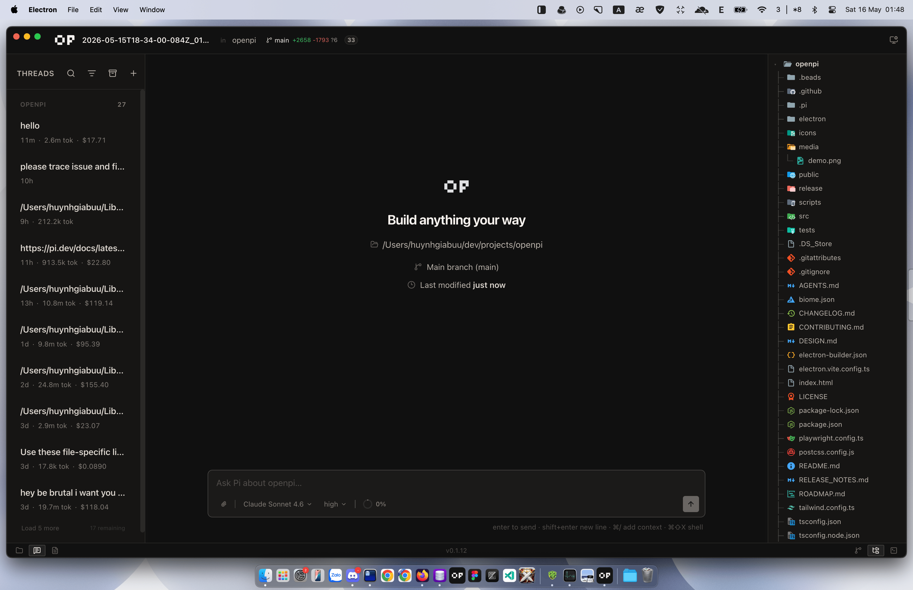

# OpenPi

A desktop workbench for the [Pi coding agent](https://github.com/earendil-works/pi).

[](https://github.com/heyhuynhgiabuu/openpi/actions/workflows/ci.yml)
[](https://github.com/heyhuynhgiabuu/openpi/releases)
[](LICENSE)

OpenPi wraps Pi's sessions, agent events, customizations, file search, source control, diffs, and terminals in a local Electron app. It is not a fork of Pi's agent runtime; OpenPi hosts `@earendil-works/pi-coding-agent` in Electron main and presents it with a desktop UI.



## What is Pi?

Pi is an open-source coding agent project by Earendil Works. Learn more from the upstream project:

- [earendil-works/pi on GitHub](https://github.com/earendil-works/pi)
- [Pi documentation](https://pi.dev/docs/latest)
- [`@earendil-works/pi-coding-agent`](https://github.com/earendil-works/pi/tree/main/packages/coding-agent)

OpenPi builds on Pi's SDK instead of reimplementing the agent runtime, session tree, tool execution, extensions, or model/provider behavior.

## Current beta surface

- **Pi sessions in a desktop shell** — session sidebar, workspace grouping, model selector, conversation stream, tool cards, and token/cost metadata.
- **Command palette** — `Shift+Cmd+P` searches commands, files, and sessions.
- **Customizations** — manage Pi Extensions, Skills, Prompts, Themes, Packages, Models, General settings, Notifications, Keybindings, Updates, and About.
- **Source control** — persistent Git panel, file tree, search, split diff viewer, and file viewer, with mutations owned by Electron main.
- **Terminal/output panel** — local PTY lifecycle through Electron main, not the renderer.
- **Built-in subagents** — three Pi SDK-native tools (`Agent`, `get_subagent_result`, `steer_subagent`) with 5 built-in agent types: Worker (surgical implementer), Explorer (codebase cartographer), Scout (external research), Planner (architecture), Reviewer (code review). Custom agents via `.pi/agents/*.md` files with full frontmatter support.
- **Subagent widget** — live status tray with elapsed timer, expandable detail panel, real-time activity stream, and completion notification banner.
- **@mention autocomplete** — `@` in composer shows subagents and files with visual chips, capital-case display, and keyboard navigation.
- **Agent prompt tuning** — tool description tells Pi to delegate on `@agent_name` patterns; prompts with explicit subagent identity headers.
- **OpenPi branding and release automation** — app icon, dynamic app version, CI, and tag-triggered beta builds.

## Architecture boundaries

OpenPi follows three hard boundaries:

1. **Renderer renders only.** It collects intent and displays state. It does not access the filesystem, shell, Git, SQLite, secrets, or Pi internals directly.
2. **Electron main owns desktop authority.** IPC handlers validate payloads with Zod and perform privileged actions: Pi SDK hosting, PTY, Git, SQLite, file search, app metadata, and native dialogs.
3. **Pi SDK owns agent semantics.** Session trees, compaction, queues, tools, extensions, providers, and model behavior remain Pi's responsibility.

See [`AGENTS.md`](AGENTS.md) for the full project rules and [`ROADMAP.md`](ROADMAP.md) for the beta roadmap.

## Install with Homebrew

Recommended for macOS beta users:

```sh
brew tap heyhuynhgiabuu/openpi
brew install --cask openpi
```

Upgrade later with:

```sh
brew update
brew upgrade --cask openpi
```

## Install from source

Requirements:

- Node.js 22+
- npm
- macOS, Linux, or Windows for development builds

```bash
git clone https://github.com/heyhuynhgiabuu/openpi.git
cd openpi
npm ci
npm run dev
```

## Development

```bash
npm run lint       # Biome checks
npm run typecheck  # TypeScript
npm test           # Vitest
npm run build      # Electron/Vite production build
```

Package a local unsigned beta build:

```bash
CSC_IDENTITY_AUTO_DISCOVERY=false OPENPI_RELEASE_CHANNEL=beta \
  npx electron-builder --config electron-builder.json --dir --publish never
```

## Releases

Tagged `v*` pushes run the beta release workflow and publish a GitHub release with installers attached.

```bash
npm run release:patch -- --notes "Short release note"
npm run release:prerelease -- --preid beta --notes-file /tmp/openpi-release-notes.md
npm run release:version -- 0.2.0 --notes-file /tmp/openpi-release-notes.md
git push origin main --follow-tags
```

`CHANGELOG.md` is the release-note source of truth. The beta release workflow extracts the matching `## [x.y.z]` section and publishes that body to GitHub Releases.

## Beta caveats

**macOS — app is not notarized yet.** Homebrew can handle download/install/upgrade, but macOS Gatekeeper may still block unsigned builds on first launch. If blocked, run this once in Terminal to remove the quarantine flag:

```sh
xattr -rd com.apple.quarantine /Applications/OpenPi.app
```

Then double-click the app as normal. This will no longer be required once notarization is configured.

- macOS notarization and Windows code signing are not configured yet.
- Permission gates, workspace trust hardening, protected-path policy, and keychain-backed secrets are still active roadmap items.
- Some custom-widget accessibility diagnostics are warning-level while the desktop UI matures; concrete label/button checks remain enforced.

## Contributing

Read [`CONTRIBUTING.md`](CONTRIBUTING.md) before opening issues or pull requests. Changes that cross renderer/main/Pi SDK boundaries need extra care and tests.

## License

MIT — see [`LICENSE`](LICENSE).
